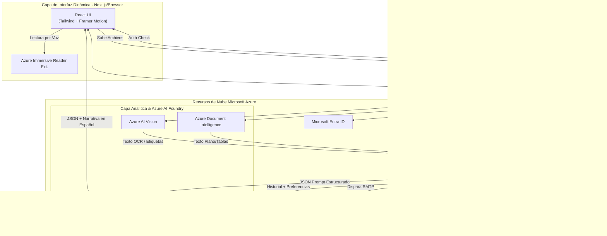
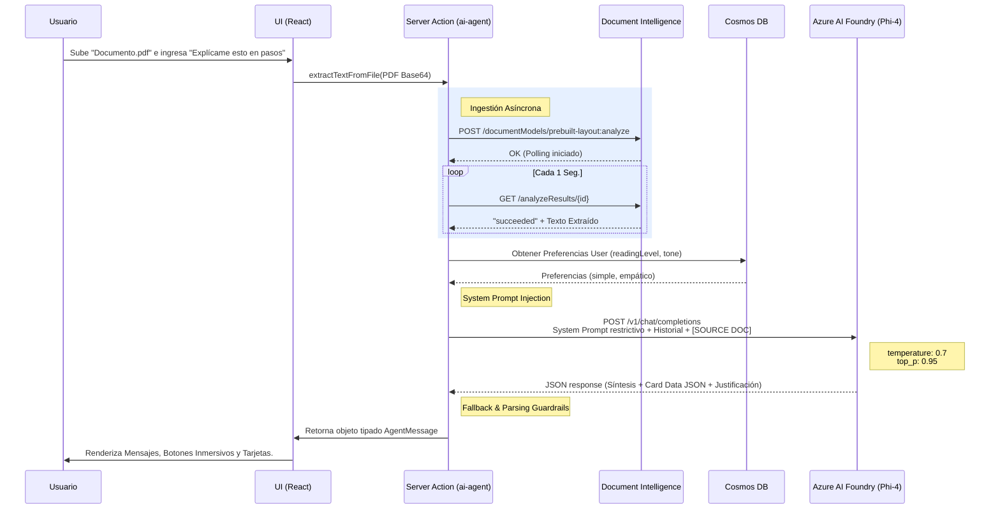
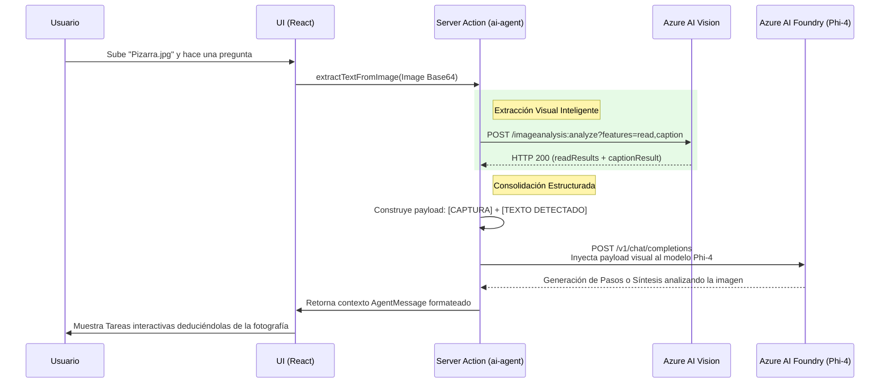

# CogniCare: Arquitectura de Software y Referencia Técnica

**Documento de Arquitectura**

**Público Destino:** 

Desarrolladores de Software, Arquitectos Cloud, Ingenieros de Datos e Inteligencia Artificial.

---

## 1. Introducción y Propósito

CogniCare es una aplicación web asistencial de vanguardia, impulsada por inteligencia artificial local y cloud-native, diseñada bajo rigurosos estándares de accesibilidad para reducir y simplificar la carga cognitiva de usuarios neurodivergentes (TDAH, Trastorno del Espectro Autista, Dislexia). 

El sistema utiliza modelos de lenguaje pequeños pero altamente capaces (SLMs como **Phi-4-multimodal-instruct** alojados en **Azure AI Foundry**) para ingerir contextos pesados y fragmentarlos en micro-tareas accionables sin abrumar al usuario.

### 1.1. Misión

Empoderar a personas neurodivergentes mediante una herramienta no intrusiva y compasiva, capaz de procesar información compleja del día a día (documentos extensos, imágenes saturadas) y estructurarla en pasos digeribles y con soporte gamificado.

### 1.2. Visión

Convertirse en el estándar arquitectónico open-source de accesibilidad cognitiva, demostrando cómo combinar infraestructura _Serverless_, modelos multimodales eficientes (Phi-4) e interfaces _Calm-UI_ para que la tecnología se adapte activamente a las necesidades neuronales del usuario.

### 1.3. Alcance del Proyecto

La aplicación abarca flujos de autenticación b2c segura, ingestión multimodal de documentos e imágenes, procesamiento conversacional, inyección dinámica de configuración (lectura inmersiva, nivel de lectura, text-to-speech), persistencia en bases NoSQL, y una interfaz rica con soporte para reestructuración del foco y recordatorios delegados por email.

---

## 2. Requerimientos del Sistema

### 2.1. Requerimientos Funcionales (RF)

- **RF-01 (Autenticación e Identidad):** 
Inicio y cierre de sesión seguro delegado mediante Microsoft Entra ID (Azure AD) a través del motor NextAuth.js.

- **RF-02 (Procesamiento Multimodal de Documentos):**
 Soporte para la ingesta y abstracción de textos planos (`.txt`), Word (`.docx`), PDF e Imágenes pesadas (`.jpg`, `.png`).

- **RF-03 (Personalización Cognitiva):** 
Selección dinámica del Nivel de Lectura, Tono Emocional del bot, temas de Alto Contraste para la fatiga visual y activación de motores Text-To-Speech.

- **RF-04 (IA Conversacional Estructurada):** 
El agente procesa documentos y genera un flujo semántico de 3 pasos: [1] Síntesis Corta, [2] Explicación simplificada, y [3] Desglose JSON interactivo que el Front-End transforma en "Tarjetas de Paso".

- **RF-05 (Soporte Text-To-Speech e Inmersivo):** Integración con botones de Lectura Inmersiva (`Azure Immersive Reader`) acoplados directamente en los nodos de respuesta del chat.

- **RF-06 (Notificaciones y Tareas):** Envío asíncrono de recordatorios de tareas hacia el correo electrónico del usuario.

- **RF-07 (Gamificación Positiva):** 
Al completarse todas las dependencias de una tarjeta de pasos interactiva, se proveerá retroalimentación motivacional visual (confeti).

### 2.2. Requerimientos No Funcionales (RNF)

- **RNF-01 (Performance y UX Calmada):** 
La arquitectura frontend debe prevenir cambios repentinos de UI. Utiliza renderizado con estado diferido y animaciones de resorte fluidas de `Framer Motion`.

- **RNF-02 (Disponibilidad y Latencia):** 
Tiempos de inferencia optimizados al invocar modelos eficientes (Phi-4) a través del endpoint unificado de Azure AI Foundry. La arquitectura gestiona activamente la latencia de red de Azure para prevenir timeouts de 65s mediante el uso de tokens Bearer y gestión optimizada de contextos.

- **RNF-03 (Tolerancia a Fallos Multimodal):** 
Si los servicios en la nube (AI Document Intelligence) sufren `timeouts`, el sistema aplica mecanismos de retries (backoff/polling) y delega tareas ligeras a extractores de texto nativos de JS (`mammoth`, `pdf-parse`).

- **RNF-04 (Privacidad y Seguridad):** 
No hay persistencia de PII (Información Personalmente Identificable) en los logs de depuración. La aplicación inyecta variables secretas solo en contexto Node (Server Actions).

---

## 3. Historias de Usuario (User Stories)

| ID | Historia de Usuario | Criterios de Aceptación |
|----|---------------------|--------------------------|
| **US-01** | Como usuario con TDAH, quiero subir mi syllabus universitario en Word para que el agente lo desglose en pequeñas tarjetas interactivas de lectura. | El sistema debe extraer el texto del `.docx`, inyectarlo al contexto del SLM (Phi-4), y devolver la UI de Tarjetas de Paso. |
| **US-02** | Como persona con dislexia, quiero configurar la IA para usar siempre un lenguaje simple y poder activar "Lectura inmersiva" con un solo clic. | Las preferencias deben guardarse en BBDD para persistir en otras sesiones y el botón Text-to-Speech debe renderizarse en todos los mensajes. |
| **US-03** | Como usuario vulnerable al estrés y fatiga de decisión, quiero que el bot tenga un modo "Pausa Activa". | La UI presentará un overlay que ocupa toda la pantalla con un ejercicio de respiración y cronómetro pomodoro. |
| **US-04** | Como usuario con memoria de trabajo limitada, quiero enviar por email una tarjeta de "Paso 2" directamente a mi bandeja de entrada. | Un botón de 'Campana' junto al paso invocará Azure Communication Services de forma asíncrona para despachar un correo sin salir del chat. |

---

## 4. Arquitectura y Stack Tecnológico (Recursos)

La arquitectura sigue el patrón **Fullstack Serverless** acoplada en un solo repositorio.

### Frontend

- **Framework Core:** Next.js 15 (React 19) estructurado bajo `App Router`.
- **Estilos:** Tailwind CSS (v4) integrado sin clases intrusivas complejas, en favor de la usabilidad.
- **Animaciones:** Framer Motion (Transiciones de tarjetas, modales y overlays).
- **Gestión de Formatos:** `react-markdown`.
- **Iconografía:** `lucide-react`.

### Backend & Middleware (Next.js Server Actions)

- **Runtime:** Entorno Edge y Node.js para peticiones y enrutamiento `/api`.
- **Autenticación B2B/B2C:** `next-auth` (v4) configurado con `@azure/identity` / Azure AD (`Microsoft Entra ID`).

### Servicios Cloud (Azure Data & Identity)

- **Azure Cosmos DB para NoSQL:** Repositorio principal; persiste historiales de chat y preferencias de usuario (bajo latencia). Incluye rutinas de inicialización determinísticas (`scripts/seed-db.ts`) para despliegues Zero-Friction.

- **Azure Communication Services (Email):** Servicio SMTP transaccional serverless para envío de recordatorios de tarjetas.

- **Microsoft Entra ID (Azure AD):** Proveedor de autoridad para cuentas.

### Ecosistema de Inteligencia Artificial

*El corazón del procesamiento de CogniCare no se basa en el endpoint de "OpenAI", sino que se apoya en el stack de servicios cognitivos de nueva generación.*

- **Azure AI Foundry (SLM / LLM Core):** Configurado con el modelo base inteligente **`Phi-4-multimodal-instruct`** para razonamiento lógico complejo sobre documentos pesados y control estricto de JSON format.

- **Azure Document Intelligence (OCR Avanzado):** Utiliza el modelo `prebuilt-layout` para realizar polling y entender estructuras densas (fórmulas, tablas) en archivos PDFs subidos por el usuario.

- **Azure AI Vision (Image Analysis):** Analiza subidas tipo JPG/PNG para extraer características estáticas o `readResults` antes de pasarlas a Phi-4 Multimodal.

- **Azure Immersive Reader:** Componente incrustado para manipulación, escalado de texto y soporte fonético asistido por voz.

### 4.1. Contenedorización y Despliegue Cloud-Native (Docker)

El ecosistema completo está diseñado para despliegues orquestados (Ej: Azure Container Apps o AKS) respetando los lineamientos **12-Factor App** mediante un `Dockerfile` optimizado en 3 etapas (Multi-stage build):

1. **Etapa de Compilación:** Compilación del entorno Next.js mediante el modo `standalone` (output tracing) para comprimir el tamaño final excluyendo librerías residuales.

2. **Capa Zero-Trust (Seguridad):** La imagen final (`node:20-alpine`) se ejecuta exclusivamente bajo un usuario restringido y no-root (`uid: 1001 nextjs`), mitigando masivamente ataques de elevación de privilegios en el clúster.

3. **Inyección Dinámica:** No existen configuraciones hardcodeadas; los puertos (ej: `PORT 3000`) y secretos se inyectan en tiempo de ejecución de la imagen permitiendo la transportabilidad absoluta del contenedor.

---

## 5. Diagramas de Arquitectura 

### 5.1. Arquitectura de Componentes (C4 Nivel 2: Containers)
Este diagrama describe cómo interactúan los servicios Serverless de Next.js con la capa nativa de Azure en la nube.

### 5.2. Flujo de Secuencia: Ingesta Semántica y Respuesta del Agente

Un reto técnico resuelto en el proyecto es lograr que la inteligencia artificial responda siempre con un contexto útil (sin repeticiones) respetando la gramática en lenguaje español, mediante mitigación exhaustiva en la configuración de "penalties".

### 5.3. Flujo de Secuencia: Análisis Viso-Cognitivo de Imágenes

Cuando el usuario adjunta una fotografía, esquema o captura de pantalla (ej. foto de una pizarra o apuntes en papel), el sistema redirige la extracción a **Azure AI Vision** para obtener el texto y un título descriptivo antes de enviarlo al razonamiento conversacional:

---

## 6. Referencia Técnica del "CogniCare Agent" (`ai-agent.ts`)

Para asegurar el éxito en las respuestas dirigidas a personas neurodivergentes de la aplicación, el "Prompt Pipeline" (Motor de inyección Cero-Shot de IA) contiene reglas robustas para proteger contra alucinaciones (Fabricated Info) y colapsos de lenguaje.

### 6.1. Resolviendo Colapsos Generativos y "Sopas de JSON"
La gran mayoría de modelos configurados por defecto tienen problemas para generar JSON extensos en idioma español. 
En `src/lib/ai-agent.ts`, se eliminaron configuraciones nocivas como un valor superior a `0.0` en el `frequency_penalty`.

- **Por qué:** El idioma español depende intensamente de las conjunciones (el, la, por, para, que). Si la API de Azure AI Foundry fuerza parámetros de penalidad en alta intensidad, el modelo colapsa porque no sabe cómo estructurar sintaxis sin re-usar esas mismas preposiciones, produciendo respuestas ilegibles como *"Aplica del la enc el con el"* en los objetos JSON.

- **La solución actual:** Se implementan rangos de temperatura optimizados (`temperature=0.7`) para mayor fluidez empática, con guardarraíles estrictos en el parsing de etiquetas para asegurar que el JSON sea siempre válido incluso en contextos pesados de hasta 12,000 caracteres.

### 6.2. Arquitectura de Prompts Obligatoria (Format Guardrails)
La estructura del sistema prohíbe el metatexto conversacional o "Meta-talk" indeseado (*"Claro, aquí tienes tu proceso..."*). La directriz actual sobre el modelo `Phi-4` exige el uso riguroso de `Markdown Headers`:

1. `### Síntesis`: Explicación nuclear y reducida.
2. `### Te explico de manera sencilla`: Adaptado vía prompt (basado en Cosmos DB) al *reading_level* del usuario.
3. `[JSON_START]`: Nodo que inyecta tareas procesables para el gestor reactivo del Frontend.
4. `[EXPLICACION_START]`: Justificación neurolingüística del modelo al momento de elegir el tono. Esta variable no se pinta en pantalla, sino que abre el Modal Popup *"Explicar Respuesta"* de la UI.

### 6.3. Estabilización de Conectividad (Azure MaaS)
Tras auditoría técnica, la conectividad se ha blindado mediante:
1.  **Bearer Authentication**: Inyección de encabezado `Authorization: Bearer` junto a `api-key` para asegurar el paso a través de los diversos API Gateways de Azure Foundry.
2.  **Modulación vs Monolito**: El sistema delega la lógica de negocio a la carpeta `src/lib`, manteniendo las rutas de la API limpias y reduciendo la deuda técnica de red.

---

