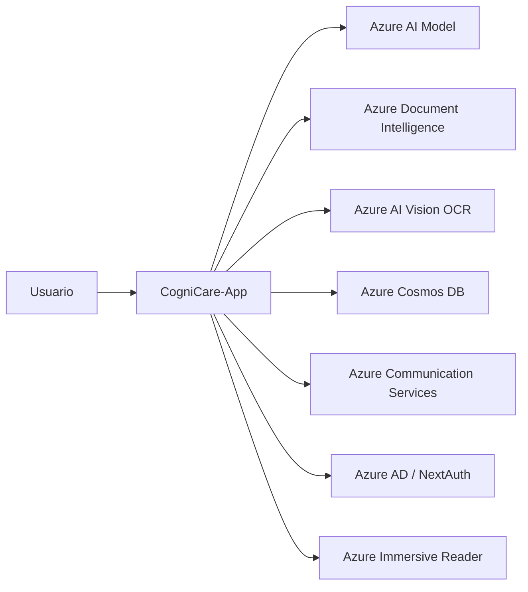
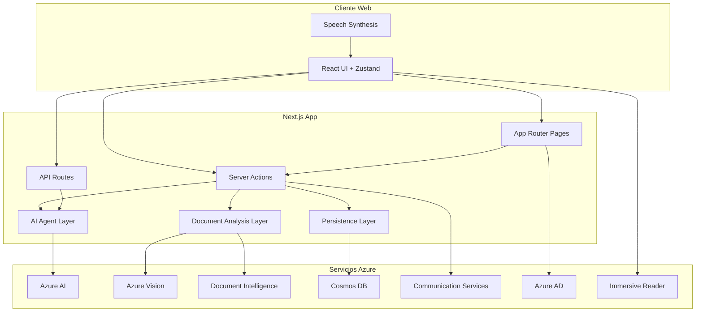
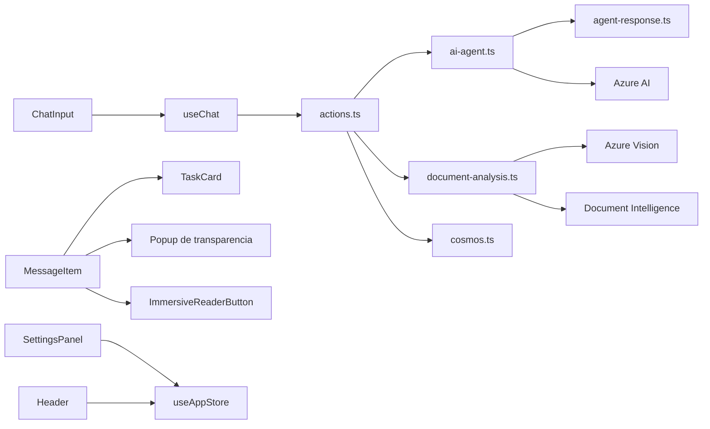
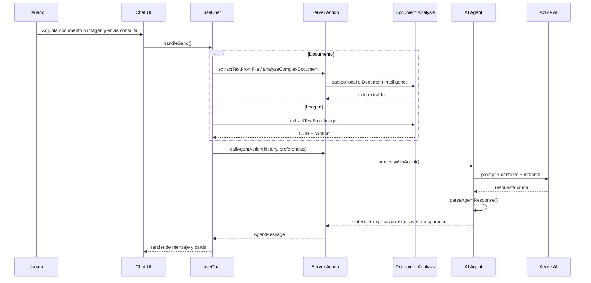
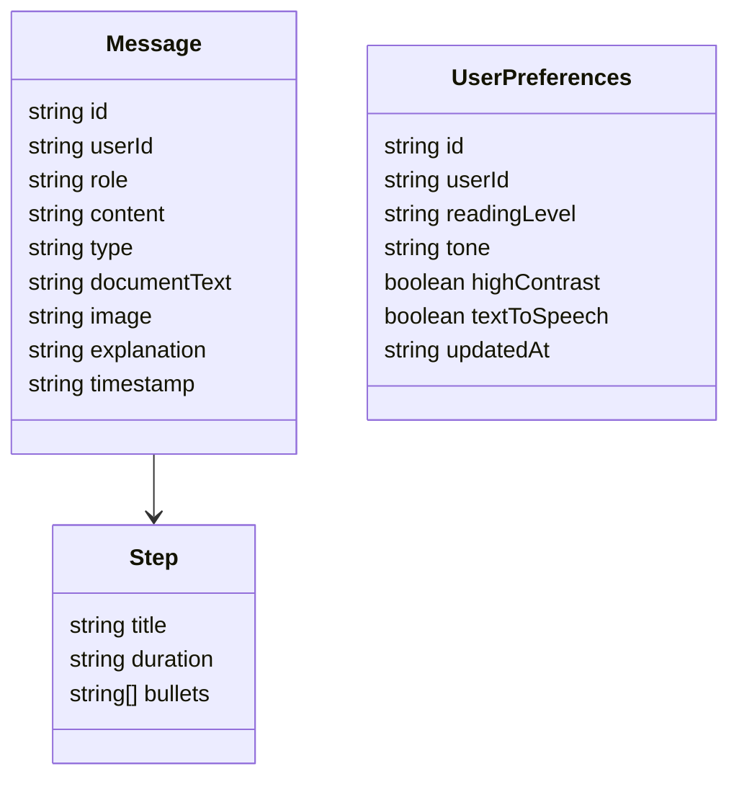
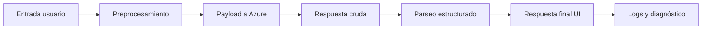
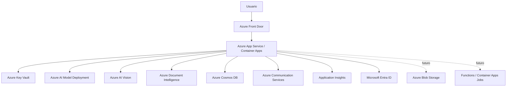

# CogniCare-App

## Documento Funcional, Técnico y de Arquitectura

**Versión:** 1.0  
**Fecha:** 27 de marzo de 2026  
**Proyecto:** CogniCare-App  
**Base de análisis:** Implementación actual del repositorio

## 1. Resumen Ejecutivo

CogniCare-App es una aplicación web de asistencia cognitiva diseñada para acompañar a personas neurodiversas en tareas de comprensión, organización y ejecución. El sistema combina una interfaz conversacional accesible con servicios de inteligencia artificial para simplificar información, analizar documentos e imágenes, generar tareas accionables y ofrecer apoyo multimodal mediante lectura en voz alta, recordatorios por correo, temporizador de foco e Immersive Reader.

El producto está orientado a reducir la sobrecarga cognitiva y mejorar la autonomía del usuario en contextos laborales, educativos y de productividad personal.

## 2. Misión

Facilitar la comprensión y organización de información compleja mediante una experiencia conversacional accesible, calmada y adaptativa para personas neurodiversas.

## 3. Visión

Convertirse en una plataforma de apoyo cognitivo confiable, transparente y multimodal, capaz de transformar contenido complejo en acciones claras, comprensibles y sostenibles para el usuario.

## 4. Objetivos del Sistema

- Simplificar contenido textual, documental y visual.
- Adaptar la comunicación al nivel de lectura y tono preferidos del usuario.
- Transformar respuestas en pasos concretos y ejecutables.
- Favorecer comprensión, enfoque y autonomía.
- Aportar transparencia explicando por qué el sistema respondió de determinada manera.
- Ofrecer continuidad mediante historial, preferencias y recordatorios.

## 5. Alcance

### 5.1 Alcance incluido

- Chat conversacional con agente asistivo.
- Carga de imágenes y documentos.
- Extracción de texto desde PDF, Word, texto plano e imágenes.
- Síntesis, explicación y generación de tareas.
- Renderización de tareas como tarjetas independientes.
- Explicación de transparencia mediante popup dedicado.
- Lectura por voz de mensajes y explicaciones.
- Temporizador Pomodoro o pausa activa.
- Historial de conversaciones.
- Persistencia de mensajes y preferencias por usuario.
- Autenticación con Azure AD vía NextAuth.
- Soporte para Azure Immersive Reader.
- Recordatorios por email.

### 5.2 Futuras funcionalidades

- Gestión multirol o administración avanzada.
- Analítica avanzada de uso.
- edición colaborativa en tiempo real.
- Flujos offline.
- Panel de administración.
- Métricas clínicas o diagnósticas.

## 6. Perfil de Usuarios

### 6.1 Usuario final
Persona que necesita apoyo para comprender información, planificar tareas o reducir carga cognitiva.

### 6.2 Usuario autenticado

Usuario con inicio de sesión habilitado para persistencia de historial, preferencias y recordatorios.

### 6.3 Operador técnico

Perfil encargado de configurar variables de entorno, servicios Azure y despliegue.

## 7. Propuesta de Valor

- Reduce complejidad sin perder propósito.
- Convierte contenido en acciones concretas.
- Respeta preferencias cognitivas y sensoriales.
- Agrega mecanismos de responsabilidad y transparencia.
- Integra IA con funciones de accesibilidad y productividad real.

## 8. Stack Tecnológico

| Capa | Tecnología | Uso |
|---|---|---|
| Frontend | Next.js 16 App Router | Aplicación web principal |
| UI | React 19 | Componentes y flujo cliente |
| Estado | Zustand | Estado global de UI y chat |
| Estilos | Tailwind CSS 4 | Diseño visual y responsive |
| Animaciones | Framer Motion | Transiciones y microinteracciones |
| Autenticación | NextAuth + Azure AD | Inicio de sesión |
| Backend BFF | Server Actions + Route Handlers | Lógica de integración |
| IA generativa | Azure AI / modelo multimodal | Respuesta asistida |
| OCR imagen | Azure AI Vision | Lectura de texto en imágenes |
| Análisis documental | Azure Document Intelligence | Extracción de contenido complejo |
| Persistencia | Azure Cosmos DB | Historial y preferencias |
| Email | Azure Communication Services | Recordatorios |
| Accesibilidad | Azure Immersive Reader | Lectura inmersiva |
| Parsing documentos | `pdf-parse`, `mammoth` | PDF y Word |
| Testing | Jest + Testing Library | Validación automatizada |

## 9. Requisitos Funcionales

| ID | Requisito |
|---|---|
| RF-01 | El sistema debe permitir enviar consultas por texto. |
| RF-02 | El sistema debe permitir adjuntar imágenes. |
| RF-03 | El sistema debe permitir adjuntar documentos PDF, Word y texto. |
| RF-04 | El sistema debe extraer texto desde imágenes mediante OCR. |
| RF-05 | El sistema debe analizar documentos complejos mediante Azure Document Intelligence. |
| RF-06 | El sistema debe generar una síntesis del contenido recibido. |
| RF-07 | El sistema debe generar una explicación sencilla y adaptada al nivel de lectura configurado. |
| RF-08 | El sistema debe generar tareas para reforzar comprensión y aplicación. |
| RF-09 | El sistema debe renderizar cada tarea como card independiente. |
| RF-10 | El sistema debe estimar una duración por tarea. |
| RF-11 | El sistema debe ofrecer lectura en voz alta de respuestas y explicaciones. |
| RF-12 | El sistema debe permitir abrir una explicación de transparencia sobre la respuesta generada. |
| RF-13 | El sistema debe almacenar historial de conversaciones por usuario autenticado. |
| RF-14 | El sistema debe almacenar preferencias de lectura, tono, contraste y apoyo por voz. |
| RF-15 | El sistema debe permitir consultar historial previo. |
| RF-16 | El sistema debe permitir activar un modo de pausa activa o Pomodoro. |
| RF-17 | El sistema debe permitir enviar recordatorios por correo para tareas. |
| RF-18 | El sistema debe permitir autenticación con Azure AD cuando esté configurada. |
| RF-19 | El sistema debe permitir usar Azure Immersive Reader cuando esté configurado. |
| RF-20 | El sistema debe registrar eventos y errores relevantes para diagnóstico. |

## 10. Requisitos No Funcionales

| ID | Requisito |
|---|---|
| RNF-01 | La interfaz debe ser responsive para escritorio y móvil. |
| RNF-02 | El sistema debe priorizar lenguaje claro y accesible. |
| RNF-03 | El sistema debe permitir alto contraste. |
| RNF-04 | El sistema debe permitir apoyo por voz. |
| RNF-05 | La arquitectura debe separar UI, lógica de agente e integraciones externas. |
| RNF-06 | El sistema debe registrar errores y eventos con logging estructurado. |
| RNF-07 | La persistencia debe aislar mensajes y preferencias por usuario. |
| RNF-08 | Las integraciones externas deben estar gobernadas por variables de entorno. |
| RNF-09 | El sistema debe degradar de forma controlada si una integración externa falla. |
| RNF-10 | El sistema debe poder diagnosticarse mediante pipeline de trazas y script dedicado. |
| RNF-11 | El sistema debe ser extensible para agregar nuevos canales de accesibilidad o modelos. |
| RNF-12 | El sistema debe mantener coherencia visual y feedback claro durante procesamiento. |

## 11. Casos de Uso Principales

### CU-01 Consultar al agente

**Actor:** Usuario  
**Resultado esperado:** Recibe una respuesta clara del asistente.

### CU-02 Analizar un documento

**Actor:** Usuario  
**Resultado esperado:** El sistema extrae el contenido, genera síntesis, explicación y tareas.

### CU-03 Analizar una imagen

**Actor:** Usuario  
**Resultado esperado:** El sistema aplica OCR, interpreta el contenido y genera respuesta accionable.

### CU-04 Personalizar experiencia

**Actor:** Usuario  
**Resultado esperado:** Cambia nivel de lectura, tono, contraste y apoyo por voz.

### CU-05 Escuchar respuesta

**Actor:** Usuario  
**Resultado esperado:** El sistema lee en voz alta la respuesta o la explicación de transparencia.

### CU-06 Revisar historial

**Actor:** Usuario autenticado  
**Resultado esperado:** Accede a conversaciones previas.

### CU-07 Recibir recordatorio

**Actor:** Usuario autenticado  
**Resultado esperado:** Recibe por email un recordatorio asociado a una tarea.

### CU-08 Comprender por qué el sistema respondió así

**Actor:** Usuario  
**Resultado esperado:** Visualiza una explicación breve, transparente y audible sobre criterios, límites y justificación de la respuesta.

## 12. Historias de Usuario

- Como usuario neurodiverso, quiero recibir explicaciones más simples para entender información sin saturarme.
- Como usuario, quiero subir un documento y obtener pasos concretos para saber qué hacer después de leerlo.
- Como usuario, quiero cambiar el tono del asistente para sentirme más cómodo durante la interacción.
- Como usuario, quiero escuchar la respuesta en voz alta para reducir fatiga visual o cognitiva.
- Como usuario, quiero revisar el historial de conversaciones para retomar tareas anteriores.
- Como usuario, quiero saber por qué el sistema llegó a una respuesta para confiar más en el resultado.
- Como usuario autenticado, quiero guardar mis preferencias para no configurarlas cada vez.
- Como usuario, quiero usar un temporizador de foco para mantener el ritmo de trabajo.

## 13. Arquitectura General

La solución sigue un modelo de aplicación web full-stack en Next.js con componentes cliente, server actions y rutas API. La UI gestiona interacción y accesibilidad; la lógica de agente organiza prompts y parseo; y los servicios Azure resuelven IA, OCR, análisis documental, autenticación, persistencia y correo.

### 13.1 Diagrama de Contexto

### 13.2 Diagrama de Contenedores

### 13.3 Diagrama de Componentes Lógicos

## 14. Flujo Funcional de Documento o Imagen

## 15. Persistencia y Modelo de Datos

### 15.1 Entidades principales

- **Message**
  - `id`
  - `userId`
  - `role`
  - `content`
  - `type`
  - `documentText`
  - `image`
  - `steps`
  - `explanation`
  - `timestamp`

- **User Preferences**

  - `id`
  - `userId`
  - `readingLevel`
  - `tone`
  - `highContrast`
  - `textToSpeech`
  - `updatedAt`

### 15.2 Diagrama de Datos

## 16. Arquitectura de Seguridad

- Autenticación delegada a Azure AD mediante NextAuth.
- Asociación de historial y preferencias por `userId`.
- Secretos gobernados por variables de entorno centralizadas.
- Integraciones externas aisladas en capa de servidor.
- Fallbacks controlados cuando no hay configuración de servicios.
- Evitación de exposición directa de claves en cliente.

## 17. Accesibilidad y Diseño Inclusivo

- Adaptación del lenguaje por nivel de lectura.
- Variación de tono comunicacional.
- Modo de alto contraste.
- Lectura por voz.
- Immersive Reader.
- Tareas renderizadas como cards separadas.
- Explicación de transparencia accesible y audible.
- Refuerzo visual con animaciones suaves y feedback de estado.

## 18. Observabilidad y Diagnóstico

El proyecto incorpora logging estructurado y un pipeline de diagnóstico del agente para revisar:
- entrada recibida,
- preprocesamiento del documento,
- payload enviado al modelo,
- respuesta cruda del modelo,
- parseo final y problemas detectados.

### 18.1 Diagrama de Diagnóstico

## 19. Riesgos Técnicos Actuales

- Calidad variable del OCR o extracción documental.
- Respuestas truncadas o genéricas del modelo multimodal.
- Dependencia de configuraciones externas de Azure.
- Tiempo de respuesta elevado para documentos extensos.
- Codificación heredada con algunos textos mojibake en partes del proyecto.
- Cobertura de pruebas todavía limitada en flujos E2E reales.

## 20. Plan de Escalamiento con Infraestructura Azure

El plan de escalamiento de CogniCare-App debe responder a una realidad concreta del sistema actual: la aplicación no solo sirve páginas web, sino que también orquesta cargas variables de IA generativa, OCR, análisis documental, persistencia de historial, autenticación y notificaciones. Por eso, el escalamiento no debe pensarse como un único servidor más grande, sino como una arquitectura Azure desacoplada por capacidades.

### 20.1 Principios del plan de escalamiento

- Escalar de forma independiente el frontend, la lógica de aplicación, las integraciones cognitivas y la persistencia.
- Mantener baja latencia para la experiencia conversacional del usuario.
- Proteger la estabilidad del sistema cuando aumentan documentos largos, imágenes o concurrencia.
- Priorizar servicios administrados de Azure para reducir complejidad operativa.
- Diseñar observabilidad desde el inicio para detectar cuellos de botella por etapa.

### 20.2 Arquitectura Azure propuesta para escalamiento

| Capa | Servicio Azure propuesto | Motivo de uso |
|---|---|---|
| Presentación web | Azure App Service o Azure Container Apps | El proyecto es una app Next.js full-stack con server actions y rutas API. Ambos servicios permiten desplegar la app completa sin separar frontend y backend en esta etapa. |
| Entrega global | Azure Front Door | Mejora latencia, terminación TLS, enrutamiento global y protección de entrada. Es útil porque CogniCare tiene usuarios interactivos sensibles al tiempo de respuesta. |
| Ejecución de procesos asíncronos futuros | Azure Functions o Container Apps Jobs | Conveniente para desacoplar tareas pesadas como reintentos de análisis, notificaciones diferidas o lotes documentales. |
| IA generativa | Azure AI / Azure OpenAI deployment dedicado | La app ya depende de un modelo multimodal. Escalar aquí implica separar capacidad del modelo respecto del servidor web. |
| OCR y análisis documental | Azure AI Vision + Azure Document Intelligence | Ya están integrados. Deben escalar como servicios independientes porque su carga no coincide siempre con la del chat. |
| Persistencia | Azure Cosmos DB | La estructura actual de mensajes y preferencias encaja bien con un modelo documental particionado por usuario. |
| Identidad | Microsoft Entra ID | Ya utilizado vía NextAuth con Azure AD. Escala naturalmente como servicio administrado. |
| Secretos y configuración | Azure Key Vault + App Configuration | Reduce riesgo operativo y evita dependencia excesiva de `.env.local` en entornos productivos. |
| Observabilidad | Azure Monitor + Application Insights + Log Analytics | Permite seguir tiempos, errores y trazas del pipeline del agente ya implementado. |
| Archivos y adjuntos futuros | Azure Blob Storage | Recomendable cuando los adjuntos ya no deban viajar enteramente embebidos en la solicitud. |
| Email | Azure Communication Services | Ya alineado con el producto y apropiado para recordatorios transaccionales. |

### 20.3 Por qué usar cada componente en el escalamiento

#### Azure App Service o Azure Container Apps

Se usan porque Cognicare es una aplicación Next.js con SSR, server actions y rutas API. No basta un hosting estático.  
App Service es apropiado si se busca simplicidad operativa y despliegue administrado tradicional.  
Container Apps es mejor si se quiere elasticidad más fina, revisiones, escalado basado en concurrencia y una evolución más natural hacia componentes desacoplados.

#### Azure Front Door

Se usa porque la experiencia del usuario depende de respuestas rápidas y estables. Front Door ayuda a reducir latencia percibida, mejora disponibilidad regional y permite proteger la entrada pública del sistema con reglas y caching donde corresponda.

#### Azure AI dedicado para el modelo

Se usa separado del cómputo de la app porque el cuello de botella principal del sistema no es solo renderizar UI, sino procesar consultas cognitivas. Esto permite escalar capacidad del modelo sin escalar innecesariamente la aplicación web y viceversa.

#### Azure Document Intelligence y Vision

Se mantienen como servicios independientes porque el patrón de uso de documentos e imágenes puede crecer de forma distinta al chat normal. Esto evita sobredimensionar el servidor de la app para cargas de OCR o parsing documental.

#### Azure Cosmos DB

Se usa porque el modelo actual ya persiste mensajes y preferencias como documentos JSON por usuario. Cosmos es coherente con esta estructura, escala horizontalmente, soporta baja latencia y se alinea con el patrón de partición por `userId` ya implementado.

#### Azure Key Vault

Se recomienda porque el proyecto depende de muchas credenciales: modelo, OCR, Cosmos, Immersive Reader, email y autenticación. Centralizar secretos reduce riesgo de fuga y simplifica rotación.

#### Application Insights

Se recomienda porque el sistema ya tiene un pipeline de diagnóstico por etapas en el agente. Application Insights permitiría convertir esas trazas en telemetría consultable: tiempo de OCR, tiempo de IA, tamaño del documento, errores por proveedor, tasa de respuestas truncadas y latencia por flujo.

### 20.4 Fases de escalamiento

#### Fase 1. Producción inicial controlada

- Desplegar la app en Azure App Service.
- Mantener Azure AI, Vision, Document Intelligence y Cosmos como servicios administrados.
- Configurar Application Insights y Key Vault.
- Habilitar Front Door solo si se requiere acceso externo de baja latencia.

**Por qué esta fase:** minimiza complejidad y permite salir a producción con una topología estable y comprensible.

#### Fase 2. Escalamiento por crecimiento de usuarios

- Migrar o desplegar la app en Azure Container Apps si la concurrencia comienza a ser variable.
- Activar autoescalado de la app por CPU, memoria o concurrencia HTTP.
- Ajustar throughput y particionado de Cosmos DB.
- Separar el procesamiento de adjuntos pesados en procesos asíncronos.

**Por qué esta fase:** el principal riesgo no será solo el tráfico, sino la mezcla entre usuarios concurrentes y cargas cognitivas pesadas.

#### Fase 3. Escalamiento por complejidad de procesamiento

- Incorporar colas para análisis documental pesado.
- Subir archivos a Blob Storage y procesarlos por referencia en lugar de enviar grandes blobs embebidos.
- Ejecutar OCR y análisis documental mediante workers o jobs desacoplados.
- Reservar capacidad específica del modelo si la demanda lo justifica.

**Por qué esta fase:** cuando crecen los adjuntos, el problema deja de ser web y pasa a ser de procesamiento distribuido y control de tiempos.

### 20.5 Diagrama de escalamiento propuesto

### 20.6 Estrategia de escalamiento por componente

| Componente | Estrategia |
|---|---|
| Next.js App | Escalado horizontal de instancias, priorizando statelessness y variables externas. |
| Modelo IA | Incrementar capacidad del deployment o separar deployments por tipo de uso. |
| OCR | Mantener como servicio externo y medir latencia por imagen. |
| Análisis documental | Desacoplar trabajos pesados y usar colas en futuras fases. |
| Cosmos DB | Particionar por usuario, ajustar RU/s y revisar consultas históricas. |
| Email | Mantener transaccional y desacoplado del flujo crítico cuando sea posible. |
| Telemetría | Centralizar métricas, logs y trazas por operación. |

### 20.7 Riesgos de escalamiento y mitigaciones

| Riesgo | Mitigación |
|---|---|
| Respuestas lentas por documentos extensos | Compactación de texto, colas, procesamiento asíncrono y límites de tamaño. |
| Saturación del modelo IA | Separar capacidad del deployment y medir concurrencia real. |
| Crecimiento del historial | TTL o políticas de archivado y control de RU/s en Cosmos DB. |
| Dependencia de demasiadas credenciales | Uso de Key Vault y Managed Identity cuando aplique. |
| Dificultad para diagnosticar errores | Application Insights, trazas por etapa y dashboard operativo. |

### 20.8 KPIs recomendados para decidir escalar

- Tiempo promedio de respuesta del chat.
- Tiempo promedio de procesamiento de documentos.
- Tasa de error por proveedor Azure.
- Porcentaje de respuestas truncadas o con fallback.
- Consumo de RU/s en Cosmos DB.
- Latencia percibida por región.
- Concurrencia simultánea de usuarios activos.

## 21. Estrategia de Calidad

- Linting con ESLint.
- Testing con Jest.
- Build de verificación con Next.js.
- Diagnóstico manual del agente con script dedicado.
- Logging por etapas para investigar errores reales de documentos o imágenes.

## 22. Recomendaciones de Evolución

- Incorporar pruebas E2E automatizadas sobre `/api/chat`.
- Formalizar una capa de DTOs o esquemas para mensajes del agente.
- Mejorar saneamiento de OCR y normalización de texto.
- Versionar prompts y políticas de transparencia.
- Añadir analítica de calidad de respuesta y tiempos de procesamiento.
- Separar aún más la capa de dominio del agente respecto de la capa UI.

## 23. Conclusión

CogniCare-App es una solución sólida de asistencia cognitiva con una propuesta de valor clara y una arquitectura moderna basada en Next.js y servicios Azure. El sistema ya ofrece capacidades relevantes de comprensión, accesibilidad y productividad. Su principal fortaleza está en la combinación de IA aplicada, diseño inclusivo y mecanismos de transparencia. La evolución natural del producto pasa por fortalecer observabilidad, calidad de respuestas con adjuntos y validación E2E.
